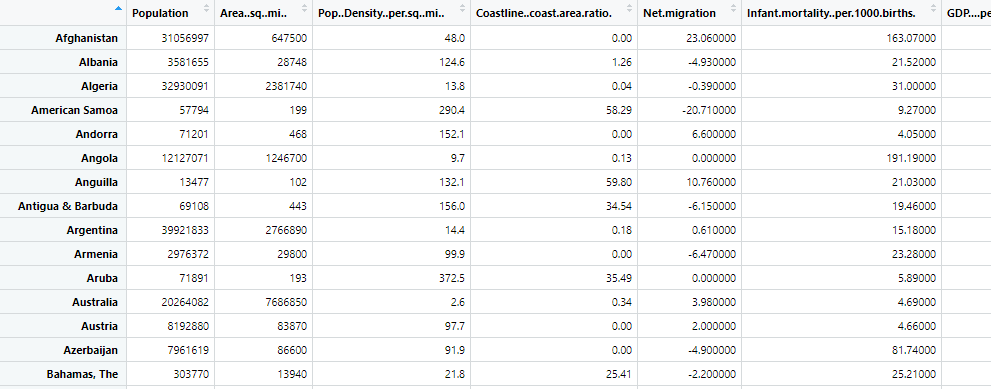
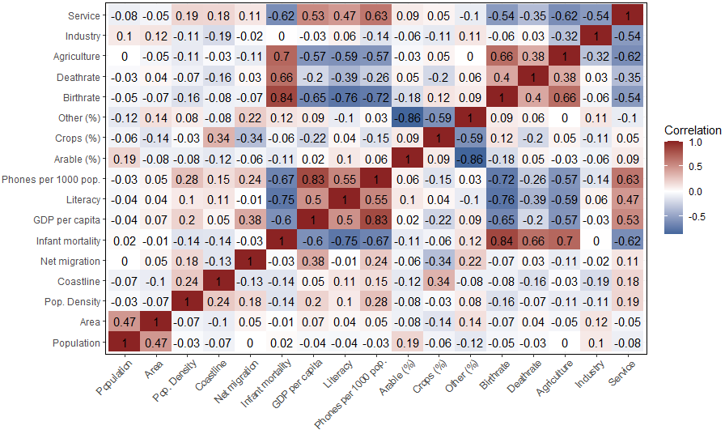
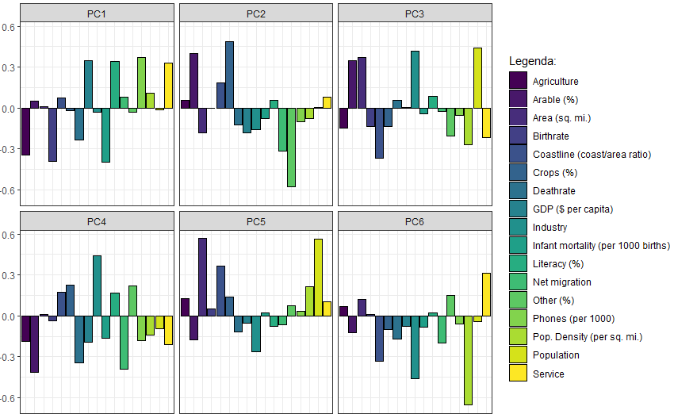
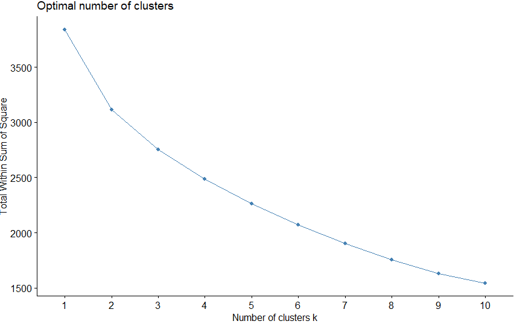
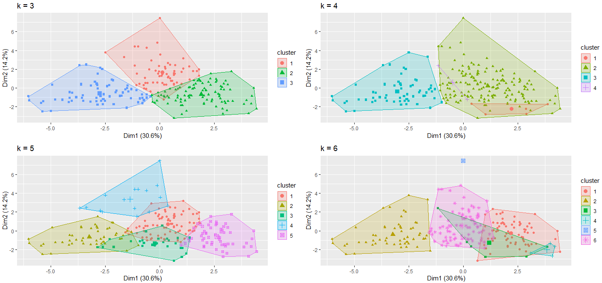
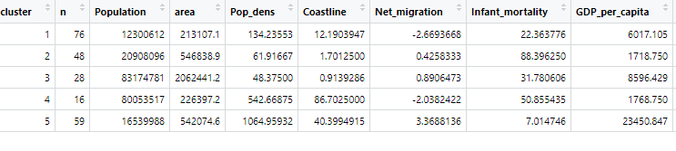
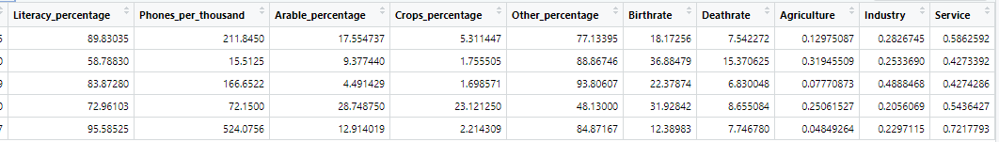
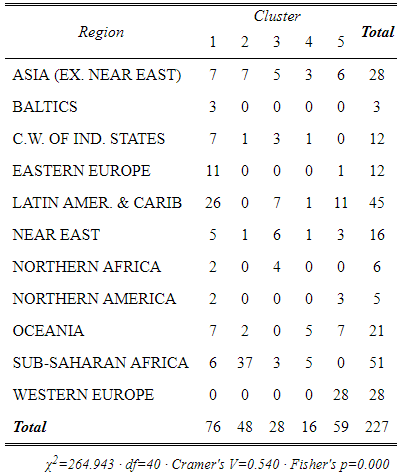
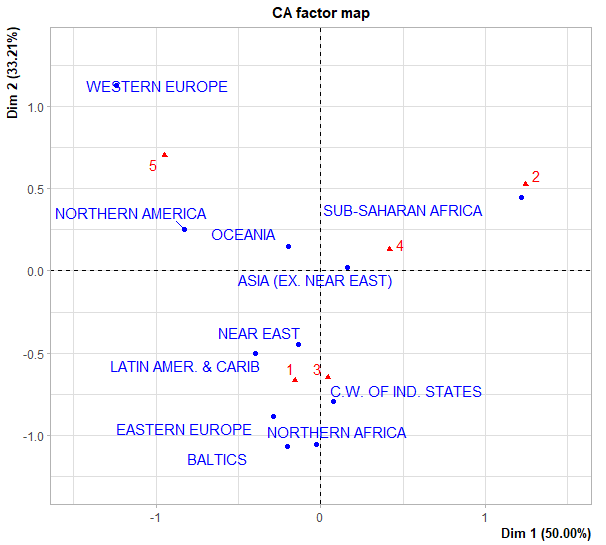
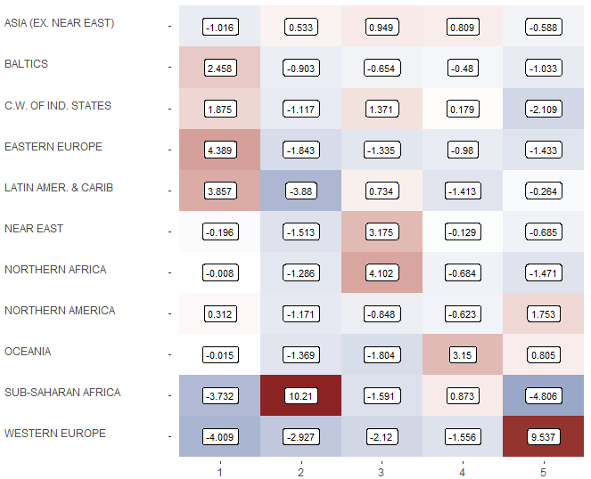

# Análise Exploratória de Países

Entre maio e julho de 2021 eu estudei muitas técnicas não supervisionadas de ciência de dados meu MBA na USP.

Para praticar, eu selecionei uma base de dados no Kaggle e realizei três análises não supervisionadas para o estudo sociodemográfico de 227 países: PCA, análise de clusters e análise de correspondência simples.

A base de dados contém dados de 1970 até 2017 e pode ser encontrada através deste link: 

https://www.kaggle.com/fernandol/countries-of-the-world

Na tabela abaixo, observa-se os primeiros dados da base de dados:

A partir das observações, foi possível determinar a matriz de correlações de Pearson entre as variáveis. Foi feito um mapa de calor para uma visualização mais fácil do comportamento conjunto dos dados.

Estabeleceu-se o segundo teste de hipótese:

__Hipótese nula__: As variáveis não se correlacionam.

__Hipótese alternativa__: As variáveis estão correlacionadas.

Para verificar qual hipótese será considerada, pode-se usar o teste de esfericidade de Bartlett. Considera-se a hipótese alternativa com 95% de confiança se valor P do teste for menor que 0.05, ou se o valor de Qui² for maior que 164 para o número correspondente de graus de liberdade.

Para a dada matriz de Pearson para essa base de dados, o valor P do teste é muito próximo de 0 e Qui² vale 2580, adotando-se, portanto, a hipótese de que as variáveis estão correlacionadas.

Para o estudo da variabilidade conjunta dos dados, foi utilizada a técnica PCA para a extração dos componentes principais. Foram utilizados apenas 6 fatores, extraídos da matriz de correlação das 17 variáveis métricas presentes na base de dados, onde os 6 fatores principais foram extraídos com base no critério de Bartlett (fatores relacionados a autovalores maiores que 1) e representam 78% da variabilidade conjunta dos dados.

Da matriz de correlação das variáveis métricas, foram obtidos os autovalores, que são representados no gráfico abaixo:

Observa-se que o fator principal (PC1), que, sozinho, representa 30% da variabilidade dos dados, é muito influenciado por indicadores sociodemográficos, correlacionando-se positivamente com indicadores de serviço, número de celulares por 1000 habitantes, alfabetização e PIB per capita, enquanto que correlaciona-se muito negativamente com indicadores de agricultura, taxa de nascimento e mortalidade infantil.
O segundo fator representa 14% da variabilidade dos dados e está correlacionado fortemente com a porcentagem de terra arável e índice de cultivo.

# Análise de Cluster
Para a análise de agrupamento dos países, foi feito um gráfico para a visualização de elbow, para obter-se uma pista sobre a melhor quantidade de grupos.

Na imagem abaixo visualiza-se os agrupamentos com 3, 4, 5 e 6 grupos no gráfico Dim1 x Dim2. As duas dimensões juntas representam 44,8% da variabilidade conjunta dos dados. O eixo horizontal representa um indicador que leva em consideração índices sociodemográficos. Quanto mais à direita, menores são os índices de analfabetismo, mortalidade infantil e natalidade e maiores são os índices de serviço, PIB per capita e acesso a telefone celular.

Quanto mais acima no gráfico, maiores são a porcentagem de terra arável e índice de cultivo.

Há outros 4 fatores, que correspondem a uma menor porcentagem na variabilidade total dos dados e não estão representados nos gráficos.

Para a análise, escolheu-se trabalhar com 5 grupos. Foram extraídas as médias de cada grupo referentes a cada variável métrica para facilitar a caracterização de cada um dos 5 grupos.

Continuação

Caracterização dos grupos de países:

|     Cluster    |     Descrição                                                                                                                                                                                                                                                                                                                                                                                                                                                                                                                                 |     Representantes (nomes em inglês)                                                                                                                                                                                                                                                                                                                                                                                                                                                                                                                                                                                                                                                                     |   |   |
|----------------|-----------------------------------------------------------------------------------------------------------------------------------------------------------------------------------------------------------------------------------------------------------------------------------------------------------------------------------------------------------------------------------------------------------------------------------------------------------------------------------------------------------------------------------------------|----------------------------------------------------------------------------------------------------------------------------------------------------------------------------------------------------------------------------------------------------------------------------------------------------------------------------------------------------------------------------------------------------------------------------------------------------------------------------------------------------------------------------------------------------------------------------------------------------------------------------------------------------------------------------------------------------------|---|---|
|     1          |     O cluster 1 é o maior de todos, com 76   representantes, Representa os países que, em média, possuem uma menor área,   menor população e menor índice de migração. Este cluster possui a segunda   melhor taxa de mortalidade infantil, alfabetização e acesso a telefones   celulares. Estando atrás apenas do cluster 5 para estes indicadores. Em média   possui índices elevados de terra arável, atrás apenas do cluster 4 para este   indicador. São países industrializados, estando atrás apenas do cluster 3   nesse quesito.    |     Mexico, Mongolia, Montserrat, Morocco,   Nauru, Nicaragua, Panama, Paraguay, Peru, Philippines, Poland, Reunion,   Romania, Saint Helena, Saint Kitts & Nevis, Saint Lucia, St Pierre &   Miquelon, Saint Vincent and the Grenadines, Samoa, Serbia, Seychelles,   Slovakia, Solomon Islands, South Africa, Sri Lanka, Suriname, Syria, Thailand,   Trinidad & Tobago, Tunisia, Turkey, Tuvalu, Ukraine, Uruguay, Uzbekistan,   Vietnam and West Bank.                                                                                                                                                                                                                                               |   |   |
|     2          |     Países com índices piores de   mortalidade infantil, PIB per capita, analfabetismo, acesso a telefones   celulares, além de ser o cluster com a maior média taxa de natalidade. Estes   países possuem os maiores índices de agricultura em média.                                                                                                                                                                                                                                                                                        |     Guinea-Bissau, Kenya, Laos, Lesotho,   Liberia, Madagascar, Malawi, Mali, Mauritania, Mayotte, Mozambique, Namibia,   Nepal, Niger, Nigeria, Pakistan, Papua New Guinea, Senegal, Sierra Leone,   Somalia, Sudan, Swaziland, Tajikistan, Tanzania, Uganda, Vanuatu, Yemen,   Zambia and Zimbabwe.                                                                                                                                                                                                                                                                                                                                                                                                    |   |   |
|     3          |     Em média, os países do cluster 3   possuem uma maior população, maior área, menor densidade populacional e menor   extensão litorânea. Em geral são países com menos terra arável em porcentagem   e menos cultivo, mas destacam-se pela industrialização e baixo índice de   mortalidade.                                                                                                                                                                                                                                                |     Algeria, Argentina, Bolivia, Brazil,   Brunei, Chile, China, Colombia, Congo, Repub. of the, Egypt, Equatorial   Guinea, Gabon, Indonesia, Iran, Iraq, Kazakhstan, Kuwait, Libya, Malaysia,   Oman, Puerto Rico, Qatar, Russia, Saudi Arabia, Turkmenistan, United Arab   Emirates, Venezuela and Western Sahara                                                                                                                                                                                                                                                                                                                                                                                     |   |   |
|     4          |     Representa uma menor quantidade de   países. Os países do cluster 4 possuem altos índices de terra arável e   cultivo. São países com alta extensão litorânea e com baixa industrialização.                                                                                                                                                                                                                                                                                                                                               |     Bangladesh, Burundi, Comoros, Gaza   Strip, Haiti, India, Kiribati, Maldives, Marshall Islands, Micronesia, Fed. St.,   Moldova, Rwanda, Sao Tome & Principe, Togo, Tonga and Wallis and Futuna.                                                                                                                                                                                                                                                                                                                                                                                                                                                                                                     |   |   |
|     5          |     Países com os melhores índices de   mortalidade infantil, PIB per capita, analfabetismo, acesso a telefones   celulares, além de ser o cluster com a menor média de taxa de natalidade                                                                                                                                                                                                                                                                                                                                                    |     Andorra, Anguilla, Aruba, Australia,   Austria, Bahamas, Bahrain, Barbados, Belgium, Bermuda, British Virgin Is.,   Canada, Cayman Islands, Cyprus, Denmark, Faroe Islands, Finland, France,   French Guiana, French Polynesia, Germany, Gibraltar, Greece, Guam, Guernsey,   Hong Kong, Iceland, Ireland, Isle of Man, Israel, Italy, Japan, Jersey,   Korea, South, Liechtenstein, Luxembourg, Macau, Malta, Martinique, Monaco,   Netherlands, Netherlands Antilles, New Caledonia, New Zealand, N. Mariana   Islands, Norway, Palau, Portugal, San Marino, Singapore, Slovenia, Spain,   Sweden, Switzerland, Taiwan, Turks & Caicos Is, United Kingdom, United   States, and Virgin Islands.    |   |   |

# Análise de Correspondência Simples
A partir dos países agrupados em 5 clusters, surge a hipótese se existe uma associação entre esses grupos e os continentes. Para se dizer que a associação entre a região e os clusters não ocorre de forma  aleatória, verifica-se se o valor P do teste Qui² é menor do que 0.05.

O valor P pode ser visualizado junto com a tabela de contingência abaixo.

De fato, o valor P é menor que 0.05, adotando-se, portanto, a hipótese de associação entre as variáveis categóricas Região e Cluster.

Utilizando o método de correspondência simples entre as duas variáveis, foi feito um mapa perceptual, capaz de representar 83% da associação entre as regiões e os clusters.

A proximidade entre o cluster 2 e a África Subsaariana no mapa sugere uma forte associação entre a região e o cluster. O mapa também sugere que os países do cluster 4 estão mais associados com a África Subsaariana, Ásia e Oceania do que com as outras regiões, o cluster 5 está associado ao oeste europeu e América do Norte e os clusters 1 e 3 estão associados ao norte da África, Báltico, América Latina e Caribe, Comunidade de Estados Independentes, Leste Europeu, Próximo-Oriente.

É importante reforçar que isso é uma sugestão de um mapa perceptual e que ele não representa 100% da inércia total. Podemos validar ou descartar hipóteses de associação através da tabela de resíduos padronizados, onde as linhas representam as regiões e as colunas representam os grupos de países. Um valor maior que 1.96 significa que podemos afirmar com mais de 95% de nível de confiança que a respectiva região está associada ao respectivo cluster.

Através da tabela de resíduos, é possível observar que não podemos nos basear somente no mapa perceptual bidimensional. Entre todas as associações citadas anteriormente, podemos verificar que as que realmente podemos afirmar com mais de 95% de nível de confiança são as associações apresentadas na seguinte tabela:

|Cluster|Associação (valor p < 0.05)                        |
|-------|---------------------------------------------------|
|   1   |	Europa Oriental, América Latina e Caribe e Báltico|
|   2   |	África Subsaariana                                |
|   3   |	Norte da África e Próximo-Oriente                 |
|   4   |	Oceania                                           |
|   5   |	Europa Ocidental                                  |

Através da utilização conjunta das técnicas de PCA, Clustering e Análise de Correspondência, foi possível estudar o comportamento conjunto das variáveis e indicadores dos países, agrupar países semelhantes entre si e realizar uma associação dos grupos de países com as regiões.

No estudo, o que me chamou a atenção foi o contraste entre o Cluster 5 e 2, associados à Europa Ocidental e África Subsaariana, respectivamente. O Cluster 5 possui os melhores indicadores de mortalidade infantil, PIB per capita, analfabetismo, acesso a telefones celulares, além de ser o cluster com a menor média de taxa de natalidade. O Cluster 2, associado à África Subsaariana, é o oposto em todas estas variáveis, tendo os piores índices e a maior média de taxa de natalidade.
